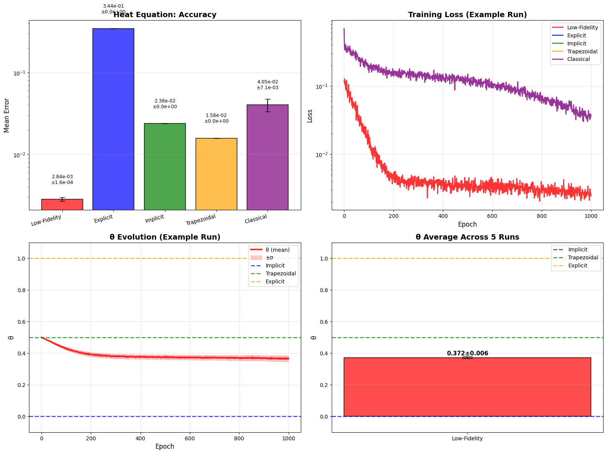
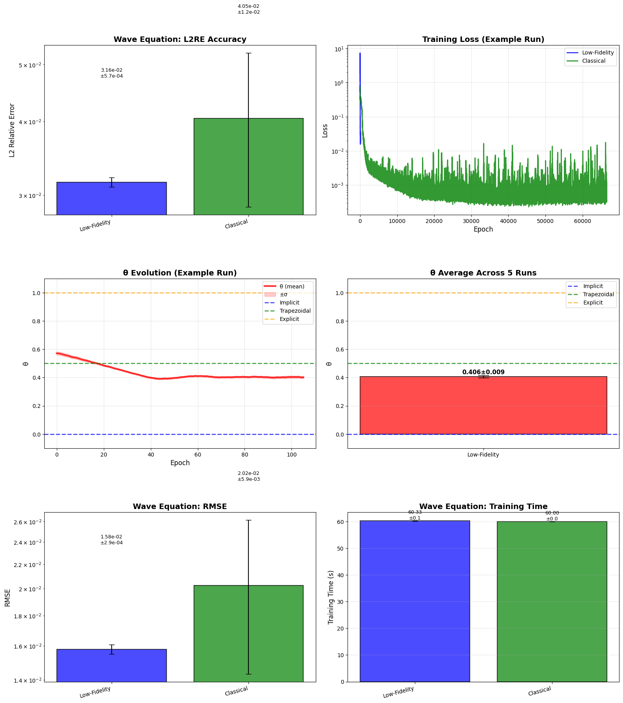
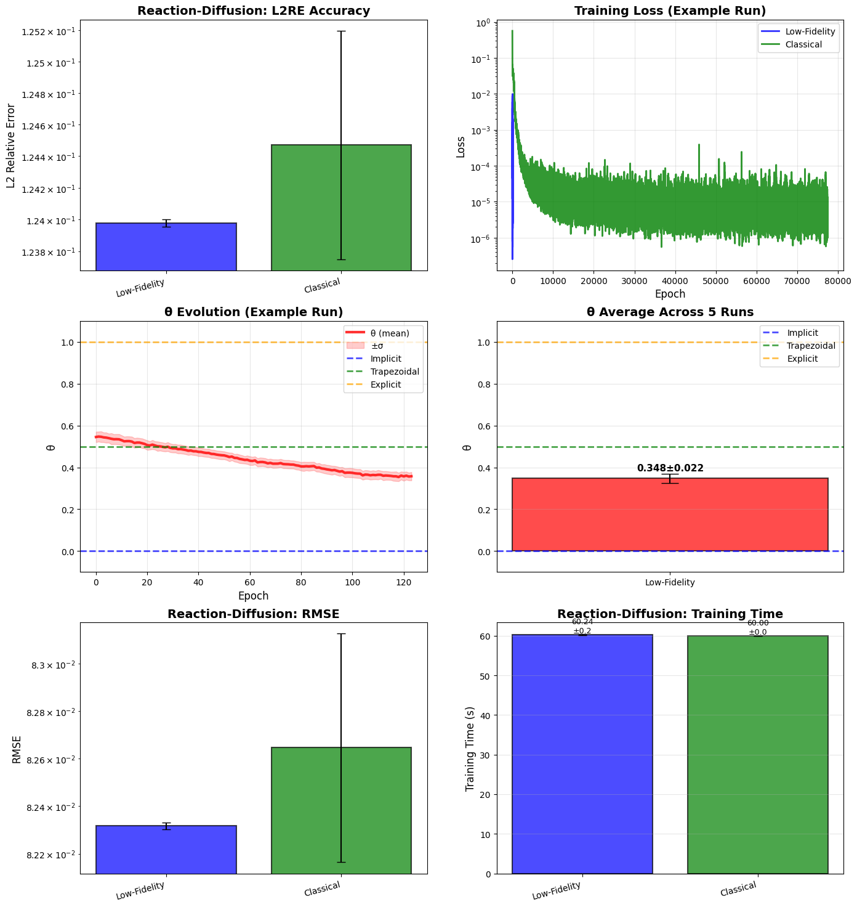
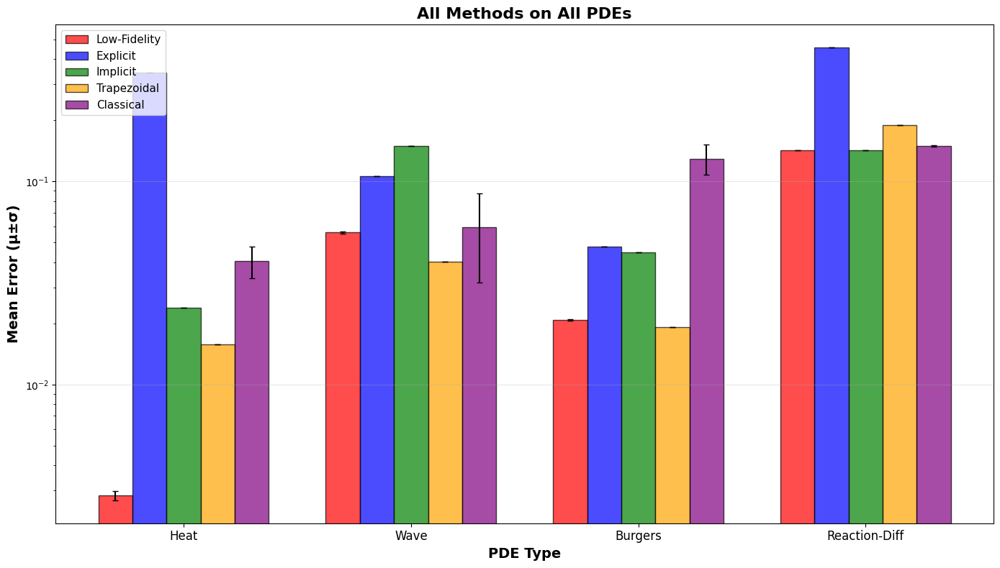

# Low-Fidelity PINN с обучаемым параметром θ-схемы

## 📋 Содержание

- [Описание проекта](#описание-проекта)
- [Структура проекта](#структура-проекта)
- [Методология](#методология)
- [Результаты экспериментов](#результаты-экспериментов)
- [Выводы](#выводы)

## Описание проекта

В данном проекте реализуется Low-Fidelity Physics-Informed Neural Network (LF-PINN) с адаптивным обобщённым методом трапеций. В отличие от классических PINN, которые аппроксимируют решение нейронной сетью напрямую, LF-PINN встраивает физику уравнения в численную схему интегрирования:

**y_{i+1} = y_i + h·[(1-θ)·f_i + θ·f_{i+1}]**

где параметр **θ ∈ [0, 1]** определяет тип схемы:
- θ = 0: Явная схема
- θ = 0.5: Классический метод трапеций
- θ = 1: Неявная схема

Вместо фиксированного θ, используется компактная нейросеть (~26 параметров), которая обучается выбирать оптимальное значение θ(x, t_i, t_{i+1}) в каждой точке пространства-времени. Это позволяет модели адаптивно переключаться между схемами в зависимости от локальных свойств решения, достигая:
- Высокой точности с минимальным числом параметров
- Интерпретируемости через визуализацию изменений θ

Проект включает сравнение с фиксированными схемами θ=(0, 0.5, 1.0) и классической PINN на четырёх типах уравнений в частных производных
## Структура проекта
```text
├── model/
│   ├── lf_pinn.py
│   ├── classic_pinn_model.py 
│   └── fixed_scheme_model.py
├── utils/
│   ├── pde_utils.py    
│   └── plot_utils.py   
├── plots/                   
│   ├── heat_pde_model_comparison.png
│   ├── wave_pde_model_comparison.png
│   ├── burgers_pde_model_comparison.png
│   ├── reaction_diffusion_pde_model_comparison.png
│   └── all_pde_model_comparison.png
├── benchmarks.ipynb
├── models_comparison.ipynb
└── README.md
```

## Методология

### θ-метод с предиктор-корректором

На каждом временном шаге:

1. **Предиктор** (Явная схема):
   y* = y_n + h·F(x, t_n, y_n)

2. **Корректор**:
   y_{n+1} = y_n + h·[(1-θ)·F(x, t_n, y_n) + θ·F(x, t_{n+1}, y*)],

где θ = θ_net(x, t_n, t_{n+1}) предсказывается нейросетью.

### Параметры обучения
```text
n_steps = 4 для волнового уравнения и уравнения теплопроводности
n_steps = 2 для уравнения Бургерса и уравнения реакции-диффузии 

n_collocation = 100     # Точки коллокации
n_bc = 10               # Точки на границах
n_ic = 10               # Точки начальных условий
epochs = 1000
learning_rate = 0.001
```
### Функция потерь

L_total = λ_pde·L_pde + λ_bc·L_bc + λ_ic·L_ic

где:
- **L_pde**: PDE loss во внутренних точках
- **L_bc**: BC loss граничных условий
- **L_ic**: IC loss от начальных условий

## Результаты экспериментов

### Уравнение теплопроводности

**PDE**: ∂u/∂t = ∂²u/∂x²



### Волновое уравнение

**PDE**: ∂²u/∂t² = c²·∂²u/∂x²



### Уравнение Бургерса

**PDE**: ∂u/∂t + u·∂u/∂x = ν·∂²u/∂x²


### Уравнение реакции-диффузии

**PDE**: ∂u/∂t = D·∂²u/∂x² + r·u·(1-u)



### Финальное сравнение



### Сводная таблица

| PDE | θ (mean±std) | PDE Residual | Max Error | Mean Error |
|-----|:------------:|:------------:|:---------:|:----------:|
| Heat | 0.3711 ± 0.0365 | 4.16e-04 | 3.53e-03 | 1.03e-03 |
| Wave | 0.3630 ± 0.1352 | 1.36e-01 | 2.20e-01 | 3.63e-02 |
| Burgers | 0.3330 ± 0.0115 | 4.35e-02 | 1.57e-01 | 2.08e-02 |
| Reaction-Diffusion | 0.1889 ± 0.0286 | 9.45e-05 | 9.23e-01 | 7.10e-02 |

## Выводы

### Анализ экспериментальных результатов

Проведённые эксперименты на четырёх типах уравнений в частных производных демонстрируют следующие закономерности:

**Low-Fidelity PINN** показывает **наилучшую или сравнимую точность** на всех четырёх задачах:
- **Heat Equation**: превосходит все методы (~2.8e-03 vs ~1.6e-02 у метода трапеций)
- **Wave Equation**: сопоставима с методом трапеций (~5.6e-02 vs ~4.0e-02)
- **Burgers Equation**: сопоставимая точность с методом трапеций (~2.08e-02 vs ~1.92e-02)
- **Reaction-Diffusion**: сопоставима с **неявным методом** (~1.42e-01 vs ~1.43×e-01), что является лучшим результатом

Явная схема (θ=1.0) демонстрирует наихудшую точность на сложных уравнениях, что подтверждает её низкую устойчивость. Классическая PINN с бОльшим числом параметров (~67) часто уступает текущей реализации (~26 параметров).

### Заключение

- **Low-Fidelity PINN превосходит** классические методы по точности при **2× меньшем числе параметров**  
- Адаптивный θ **автоматически выбирает** подходящую численную схему для каждой задачи  

